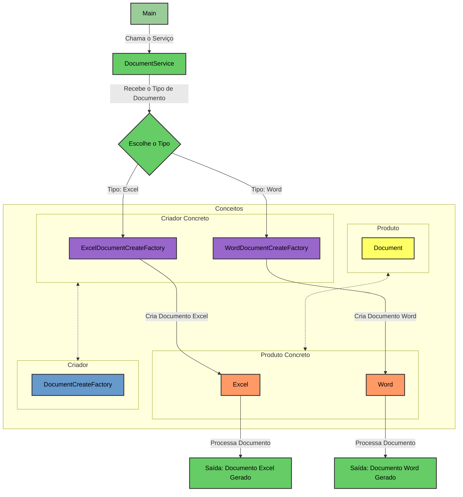

## O que é

O padrão Factory Method tem como objetivo delegar a responsabilidade de criação de objetos para subclasses, permitindo que a classe base defina o método de criação sem especificar a classe exata dos objetos que serão criados. Isso promove o princípio de responsabilidade única e facilita a extensão do sistema.

1) **Produto**: Criar uma **abstrata** ou **interface** com a representação do que e necessário para os objetos uma estrutura em comum
2) **Produto Concretos**: Aqui vamos criar os objetos e suas implementações do produto
3) **Criador**: Criar uma classe  **abstrata** ou **interface**  que ea fabricas com os padrões de criação dos objetos
4) **Criadores Concretos**: Implementa as subclasses concretas do criador, que irão definir o método factory para criar instâncias dos produtos concretos.

## Exemplo

Imagine que temos uma aplicação que tem o objetivo de processar e retornar um documento para o cliente em um formato específico como PDF, EXCEL, WORD, etc. Neste caso, como não sabemos todos os tipos de documentos que vamos utilizar, o padrão **Factory Method** se encaixa bem.




### Produto

Vamos começar criando uma classe abstrata **Documento**. Esta classe vai conter que todos os objetos devem implemente. No nosso casso pensei em em um método **process**. Este método irá gerar o documento em uma pasta temporária dentro do sistema.
```java
package br.com.matheuscalaca.factoryMethod.product;  
  
public abstract class Document {  
   public abstract void process();  
}
```
### Produto concretos

Agora, vamos criar duas classes que estendem a classe **Documento**. Essas classes são **Word** e **Excel**. que vão ter a implementação da logica para gerar e salvar o arquivo.
Para simplificar vou estar colocando somente um LOG

```java
package br.com.matheuscalaca.factoryMethod.concretProduct;  
  
import br.com.matheuscalaca.factoryMethod.product.Document;  
  
public class Excel extends Document {  
    @Override  
    public void process() {  
        System.out.println("[EXCEL] Estou gerando um documento EXCEL");  
    }  
}
```

```java
package br.com.matheuscalaca.factoryMethod.concretProduct;  
  
import br.com.matheuscalaca.factoryMethod.product.Document;  
  
public class Word extends Document {  
    @Override  
    public void process() {  
        System.out.println("[WORD] Estou gerando um documento WORD");  
    }  
}
```
### Createor (criador)

Vamos criar a interface que terá a responsabilidade de ser a fábrica que vai retornar o produto, no nosso caso, **DocumentCreateFactory**.

```java
package br.com.matheuscalaca.factoryMethod.creator;  
  
import br.com.matheuscalaca.factoryMethod.product.Document;  
  
public interface DocumentCreateFactory {  
     Document createDocument();  
}
```
### Createor Concret (criador concreto)

Vamos criar as classes que irão implementar e retornar os produtos corretos: **ExcelDocumentCreateFactory** e **WordDocumentCreateFactory**.

```java
package br.com.matheuscalaca.factoryMethod.concretCreator;  
  
import br.com.matheuscalaca.factoryMethod.concretProduct.Excel;  
import br.com.matheuscalaca.factoryMethod.creator.DocumentCreateFactory;  
import br.com.matheuscalaca.factoryMethod.product.Document;  
  
public class ExcelDocumentoCreateFactory implements DocumentCreateFactory {  
    @Override  
    public Document createDocument() {  
        return new Excel();  
    }  
}
```

```java
package br.com.matheuscalaca.factoryMethod.concretCreator;  
  
import br.com.matheuscalaca.factoryMethod.concretProduct.Word;  
import br.com.matheuscalaca.factoryMethod.creator.DocumentCreateFactory;  
import br.com.matheuscalaca.factoryMethod.product.Document;  
  
public class WordDocumentoCreateFactory implements DocumentCreateFactory {  
    @Override  
    public Document createDocument() {  
        return new Word();  
    }  
}
```
### Service

Vamos criar um serviço que terá a responsabilidade de escolher o tipo de documento, criar e processar o documento correspondente.

```java
package br.com.matheuscalaca.factoryMethod.service;  
  
import br.com.matheuscalaca.factoryMethod.concretCreator.ExcelDocumentoCreateFactory;  
import br.com.matheuscalaca.factoryMethod.concretCreator.WordDocumentoCreateFactory;  
import br.com.matheuscalaca.factoryMethod.creator.DocumentCreateFactory;  
import br.com.matheuscalaca.factoryMethod.product.Document;  
  
public class DocumentService {  
  
    public void processDocument(String Type){  
        Document document = getDocumentCreate(Type);  
        document.process();  
    }  
  
    private Document getDocumentCreate(String Type) {  
        DocumentCreateFactory documentCreateFactory;  
        switch (Type.toUpperCase()){  
            case "EXCEL":  
                documentCreateFactory = new ExcelDocumentoCreateFactory();  
                break;  
            case "WORD":  
                documentCreateFactory = new WordDocumentoCreateFactory();  
                break;  
            default:  
                throw new IllegalArgumentException("Type not found");  
        }  
        return documentCreateFactory.createDocument();  
    }  
  
}
```
### Main

No main, chamamos o serviço para processar os documentos.

```java
package br.com.matheuscalaca.factoryMethod;  
  
import br.com.matheuscalaca.factoryMethod.service.DocumentService;  
  
public class Main {  
    public static void main(String[] args) {  
        // codigo com regras  
        //chama para criar o documento        
        DocumentService documentService = new DocumentService();  
        documentService.processDocument("Excel");  
        documentService.processDocument("word");
  
    }  
}
```

### Conclusão

Neste caso, as nossas regras de negócios ficam 100% desacopladas. Se precisarmos adicionar um novo tipo ou modificar o processamento específico do **Word**, por exemplo, não afetará o restante do código.

## Opinião

Passei quase um mês estudando esse padrão de projeto. No final, entendi como ele é usado, mas ainda não consegui ser convencido do porquê de usá-lo. Na maioria dos artigos, é mencionado que ele deve ser usado em sistemas mais complexos e que facilita nesse caso. Ainda não consegui ter essa visão.

No final, entendi que ele troca o local onde colocamos o construtor do objeto, e que, para um processo onde surgem novas classes com novas funções, isso iria facilitar. Entendi que isso traz mais flexibilidade ao código.

Vamos ver se com o passar do tempo consigo entender melhor onde usar este padrão.

### Vantagens que encontrei

- **Desacoplamento**: O Factory Method desacopla o código de criação de objetos do código de negócios, facilitando mudanças na criação dos objetos sem impactar a lógica de negócios.
- **Extensibilidade**: Em sistemas que precisam ser escaláveis e flexíveis, o Factory Method permite adicionar novos tipos de produtos sem modificar o código existente.